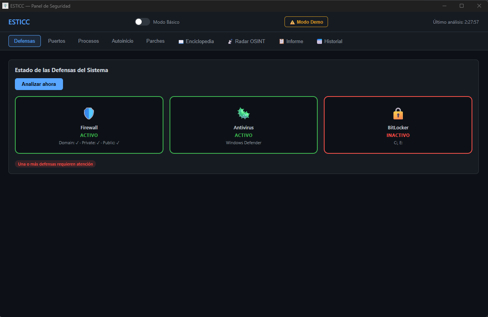

# ESTICC — Panel de Seguridad Local

[](https://github.com/yeagob556/esticc/releases/latest)
[](https://github.com/yeagob556/esticc/releases/latest)
[](License)

**ESTICC** (Entorno de Seguridad TIC) es un panel de seguridad educativo de código abierto para Windows. Combina auditoría local del sistema, inteligencia OSINT en tiempo real, simulación de amenazas y enciclopedia de malware en una sola interfaz de escritorio.

Pensado para estudiantes, PYMEs y usuarios individuales que quieran entender el estado de seguridad de su equipo sin necesidad de conocimientos técnicos previos.



---

## Características

### 🛡️ Auditoría Local
Escanea el sistema Windows en tiempo real:
- **Defensas** — estado de Firewall, Windows Defender y BitLocker
- **Puertos** — conexiones TCP activas y sockets en escucha
- **Procesos** — procesos activos con alertas de CPU/RAM elevada y ejecutables sin ruta
- **Autoinicio** — entradas de registro (Run/RunOnce) y tareas programadas
- **Parches** — actualizaciones pendientes de Windows Update

### 📡 Radar OSINT
Monitoriza 6 fuentes de inteligencia de ciberseguridad en tiempo real y correlaciona las amenazas publicadas con el estado del sistema local:
- NIST NVD · Bleeping Computer · Krebs on Security
- SANS Internet Storm Center · The Hacker News · Reddit r/netsec
- Alerta cuando un puerto abierto coincide con una amenaza publicada
- Extracción automática de CVEs y correlación de protocolos

### 🎓 Simulador de Amenazas
Modo demostración educativo con **8 escenarios de ataque** con datos ficticios completos (5 escáneres cada uno).
Cada escenario incluye una tarjeta educativa con explicación, pasos de respuesta y un botón de acceso directo a la entrada correspondiente de la Enciclopedia:

| # | Escenario | Amenaza |
|---|---|---|
| 1 | Puerto 4444 abierto | Troyano de Acceso Remoto (RAT) |
| 2 | svchost32.exe al 99% CPU | Cryptojacker disfrazado |
| 3 | Sistema abandonado (14 parches) | Exposición general |
| 4 | Exfiltración SMTP puertos 25/587 | Keylogger (Agent Tesla) |
| 5 | xmrig.exe al 95% + pool stratum | Cryptojacker (XMRig) |
| 6 | Cifrado activo + vssadmin + Defender caído | Ransomware en curso |
| 7 | 4 conexiones SMB + MS17-010 sin parchear | Gusano de Red (EternalBlue) |
| 8 | Beacon C2 powershell + dropper .vbs | Botnet zombie (Emotet) |

### 📋 Informe de Seguridad
Ejecuta los 5 escáneres de auditoría en una sola operación, calcula una puntuación de riesgo global (0–100) y genera un informe HTML completo exportable a PDF:
- Nivel de riesgo: **Bajo / Medio / Alto / Crítico**
- Hallazgos individuales con nivel de severidad y categoría
- Resumen por módulo con métricas clave
- Recomendaciones de remediación personalizadas según los hallazgos detectados
- Exportación a PDF mediante `window.print()` sin dependencias externas

### 📅 Historial de Análisis
Calendario interactivo que combina los datos de **Windows Defender** con los escaneos propios de ESTICC:
- Vista mensual con navegación de mes en mes
- Puntos de colores por tipo de evento: azul (ESTICC), verde (Defender OK), rojo (amenaza detectada)
- Clic en cualquier día para ver la timeline detallada de eventos con hora y fuente
- Tarjetas de estado: último análisis rápido y completo de Defender, protección en tiempo real, amenazas recientes
- Historial persistido en `%APPDATA%\ESTICC\historial.json` (últimas 100 entradas)
- Los informes completos se registran automáticamente en el historial al generarse

### 📖 Enciclopedia de Malware
Base de conocimiento con 10 categorías de amenazas, búsqueda en tiempo real y ficha técnica completa con:
- Técnicas MITRE ATT&CK
- Indicadores de Compromiso (IOCs)
- CVEs asociados
- Vectores de ataque, síntomas y medidas de prevención

### 🔄 Modo Básico / Avanzado
Toggle global que cambia la presentación de todos los paneles:
- **Básico** — escudos visuales con estado OK/WARN/DANGER, orientado a usuarios sin conocimientos técnicos
- **Avanzado** — tablas de datos completos, CVEs, IOCs y detalles técnicos

---

## Stack tecnológico

| Capa | Tecnología |
|---|---|
| Shell de escritorio | [Tauri 1.x](https://tauri.app/) (Rust) |
| Backend / sidecar | Python 3.8+ |
| Frontend | HTML · CSS · JavaScript vanilla |
| IPC | stdin/stdout JSON newline-delimited |
| Feeds OSINT | `feedparser` + `concurrent.futures` |
| Escaneo local | `psutil` + WMI / PowerShell |

---

## Instalación para usuarios

> **Forma recomendada** — no requiere Python, Rust ni ningún conocimiento técnico.

### 1. Descargar el instalador

**[⬇ Descargar ESTICC_Installer.exe](https://github.com/yeagob556/esticc/releases/latest/download/ESTICC_Installer.exe)**

También puedes ir a la [página de Releases](https://github.com/yeagob556/esticc/releases/latest) para ver todas las descargas disponibles.

### 2. Ejecutar el instalador

Haz doble clic en `ESTICC_Installer.exe`. El instalador:

1. Comprueba automáticamente los requisitos del sistema (Windows 10+, RAM, disco, Internet).
2. Descarga la última versión de ESTICC desde GitHub.
3. Instala los archivos en `%LOCALAPPDATA%\ESTICC\` (sin permisos de administrador).
4. Crea accesos directos en el Escritorio y en el Menú de Inicio.

Si algo falla, aparecerá un mensaje de error con instrucciones claras sobre cómo resolverlo.

### Versión portable (opcional)

Si prefieres no usar el instalador, descarga **`ESTICC_portable_win64.zip`** desde la misma página de Releases, descomprímelo en cualquier carpeta y ejecuta `ESTICC.exe`.

> **Requisito:** [WebView2 Runtime](https://developer.microsoft.com/microsoft-edge/webview2/) instalado en el sistema (incluido por defecto en Windows 11 y en Windows 10 con Edge actualizado).

---

## Requisitos previos (solo para desarrolladores)

- **Windows 10/11** (64-bit)
- **Python 3.8+** — [python.org](https://www.python.org/downloads/) *(marcar "Add Python to PATH")*
- **Rust + Cargo** — [rustup.rs](https://rustup.rs/) *(Tauri CLI se instala automáticamente)*
- **Node.js** no requerido

---

## Instalación en modo desarrollo

```bat
:: 1. Clonar el repositorio
git clone https://github.com/yeagob556/esticc.git
cd esticc

:: 2. Configurar entorno (una sola vez)
setup.bat

:: 3. Iniciar la aplicación
run.bat
```

`setup.bat` verifica las dependencias, crea un entorno virtual Python aislado e instala Tauri CLI si es necesario.

> La primera compilación de Rust puede tardar varios minutos. Las siguientes serán mucho más rápidas.

---

## Estructura del proyecto

```
esticc/
├── setup.bat                          # Configura entorno virtual + Tauri CLI (una sola vez)
├── run.bat                            # Inicia la aplicación en modo desarrollo
├── backend/
│   ├── main.py                        # Router IPC (stdin/stdout JSON)
│   ├── requirements.txt               # psutil, feedparser
│   ├── modulo_02_auditoria/
│   │   ├── escaner_puertos.py         # Conexiones TCP activas
│   │   ├── escaner_procesos.py        # Procesos + CPU/RAM
│   │   ├── analisis_autoinicio.py     # Registro Run + tareas
│   │   ├── estado_defensas.py         # Firewall, Defender, BitLocker
│   │   └── verificador_parches.py     # Windows Update pendientes
│   ├── modulo_03_radar/
│   │   ├── lector_rss.py              # Fetch concurrente de 6 feeds RSS
│   │   └── correlacion.py             # Correlación puerto/CVE con estado local
│   ├── modulo_04_reportes/
│   │   └── generador.py               # 5 escáneres + puntuación de riesgo 0-100
│   └── modulo_05_historial/
│       ├── historial_defender.py      # Consulta eventos del log de Windows Defender
│       └── historial_esticc.py        # Persiste historial propio en %APPDATA%\ESTICC\
├── frontend/
│   ├── index.html                     # SPA única con todos los paneles
│   ├── css/
│   │   ├── simulador.css
│   │   ├── enciclopedia.css
│   │   ├── radar.css
│   │   ├── reportes.css               # Estilos del informe + @media print
│   │   └── historial.css              # Calendario mensual + timeline de eventos
│   └── js/
│       ├── auditoria.js               # Renderers + botones de escaneo
│       ├── simulador.js               # Escenarios de demo + interceptor
│       ├── enciclopedia.js            # Base de datos + buscador + modal
│       ├── radar.js                   # Fetch OSINT + renderizado dual
│       ├── reportes.js                # Generación y renderizado del informe HTML
│       └── historial.js               # Calendario + window.HISTORIAL.registrar()
└── src-tauri/
    ├── src/main.rs                    # Sidecar spawn + IPC Rust↔Python
    ├── Cargo.toml
    └── tauri.conf.json
```

---

## Protocolo IPC

El sidecar Python se comunica con Rust mediante JSON newline-delimited por stdin/stdout:

```jsonc
// Solicitud (Rust → Python)
{ "id": "42", "action": "scan_ports" }
{ "id": "43", "action": "radar_correlate", "context": { "noticias": [...], "puertos": [...] } }

// Respuesta (Python → Rust)
{ "id": "42", "result": { "ok": true, "data": [...] } }
{ "id": "43", "error": "descripción del error" }
```

Acciones disponibles:

| Acción | Módulo | Descripción |
|---|---|---|
| `scan_defenses` | auditoria | Firewall, Defender, BitLocker |
| `scan_ports` | auditoria | Conexiones TCP activas |
| `scan_processes` | auditoria | Procesos con métricas |
| `scan_startup` | auditoria | Autoinicio y tareas programadas |
| `scan_patches` | auditoria | Actualizaciones pendientes |
| `radar_fetch` | radar | Descarga las últimas noticias RSS |
| `radar_correlate` | radar | Cruza noticias con el estado local |
| `generate_report` | reportes | 5 escáneres + puntuación de riesgo |
| `historial_defender` | historial | Estado y eventos del log de Defender |
| `historial_esticc_get` | historial | Lee el historial persistido de ESTICC |
| `historial_esticc_guardar` | historial | Añade una entrada al historial |

---

## Uso del Radar OSINT

Para obtener correlaciones precisas:

1. Ejecuta primero el escáner de **Puertos** (panel *Puertos*)
2. Ve al panel **📡 Radar OSINT** y pulsa *Actualizar radar*
3. ESTICC descarga las últimas noticias de las 6 fuentes y compara los puertos abiertos con las amenazas publicadas
4. Las alertas se clasifican en **Crítico** (puerto coincide con amenaza) y **Alto** (CVE publicado relevante)

---

## Datos persistentes: %APPDATA%\ESTICC\

ESTICC guarda el historial de sus propios escaneos en la carpeta de datos de aplicación del usuario:

```
C:\Users\<NombreUsuario>\AppData\Roaming\ESTICC\
└── historial.json     ← Historial de escaneos (últimas 100 entradas)
```

**¿Por qué %APPDATA%?**
- No requiere permisos de administrador para escribir.
- Sigue el estándar de Windows para datos de usuario por aplicación.
- Los datos del usuario se conservan aunque se reinstale ESTICC.
- Compatible con entornos corporativos donde `Program Files\` es de solo lectura.

**Formato de historial.json:**

```json
[
  {
    "timestamp":     "2026-05-23T10:30:00+00:00",
    "tipo":          "informe_completo",
    "nivel":         "medio",
    "puntuacion":    42,
    "num_hallazgos": 3,
    "resumen":       null,
    "fuente":        "esticc"
  }
]
```

La lista se limita a las **100 entradas más recientes** (política FIFO). Para eliminar el historial basta con borrar el archivo manualmente.

---

## Notas de seguridad

- ESTICC **solo realiza lectura pasiva** del sistema local. No modifica ningún archivo, configuración ni ajuste de red.
- El Radar OSINT realiza peticiones HTTP GET a feeds RSS públicos. No envía ningún dato del sistema a servidores externos.
- Los datos del simulador son **completamente ficticios** y se generan en el frontend sin tocar el sistema real.

---

## Changelog

### [v0.3.2](https://github.com/yeagob556/esticc/releases/tag/v0.3.2) — 2026-05-24
- **chore:** recompilación del portable con los metadatos de versión corregidos. El binario ahora reporta `0.3.2` internamente.

### [v0.3.1](https://github.com/yeagob556/esticc/releases/tag/v0.3.1) — 2026-05-24
- **chore:** versión interna de `tauri.conf.json` y `Cargo.toml` actualizada a `0.3.1` para que coincida con el tag de la release.

### [v0.3.0](https://github.com/yeagob556/esticc/releases/tag/v0.3.0) — 2026-05-24
- **fix:** suprimida la ventana de consola (terminal negra) que aparecía al iniciar ESTICC. El sidecar `backend.exe` ahora se lanza con el flag `CREATE_NO_WINDOW` de la API Win32.

### [v0.2.0](https://github.com/yeagob556/esticc/releases/tag/v0.2.0) — 2026-05-24
- **feat:** instalador gráfico `ESTICC_Installer.exe` para usuarios finales. Comprueba requisitos del sistema, descarga ESTICC desde GitHub y crea accesos directos sin necesidad de permisos de administrador.
- **feat:** versión portable `ESTICC_portable_win64.zip` lista para descomprimir y ejecutar.
- **docs:** instrucciones de instalación para usuarios finales separadas de las de desarrollo.

### [v0.1.0](https://github.com/yeagob556/esticc/releases/tag/v0.1.0) — 2026-05-24
- Primera versión pública. Incluye auditoría local, radar OSINT, simulador de amenazas, informe de seguridad, historial de análisis y enciclopedia de malware.

---

## Licencia

Este proyecto está bajo la Licencia MIT. Para más detalles, consulta el archivo [License](License) en la raíz del repositorio.
